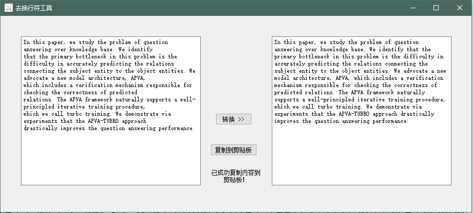

# pha2sen——去换行符工具

## python3 + PyQt5
在阅读论文时，由于英语太菜，英文论文全靠谷歌翻译，而pdf文档复制内容后会自带很多换行符，直接粘贴送去翻译十分影响翻译效果，手动将换行符逐个去掉又过于繁冗，因此开发了此轻量级的去换行符工具，可以自动将一段文字里的所有换行符去掉，并能一键将转换后的内容复制到剪贴板，方便使用  
在除论文以外的其他场所同样适用，只要你需要自动大量的去掉一段话中的换行符
## 运行截图

## 可执行文件链接（windows）
链接：https://pan.baidu.com/s/1Y87r7ji8zZTmCLOhpCOqSA  
提取码：v0tq  
